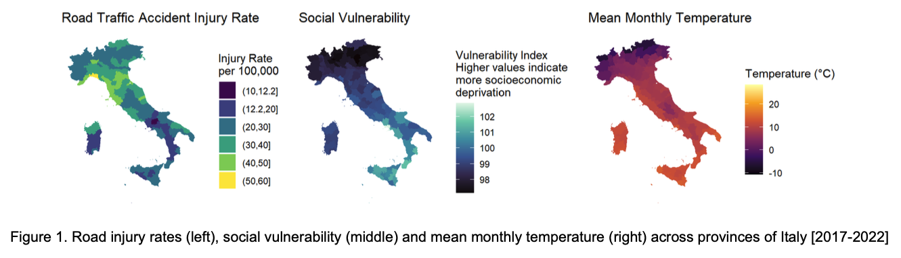
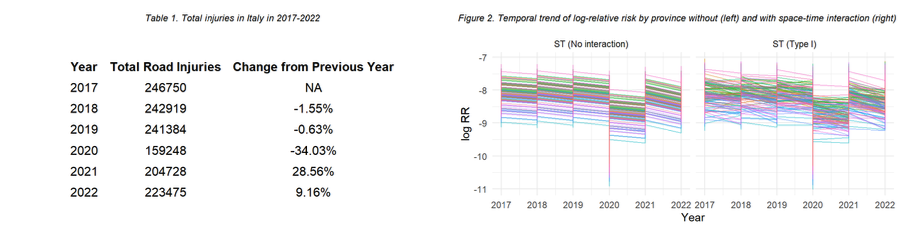
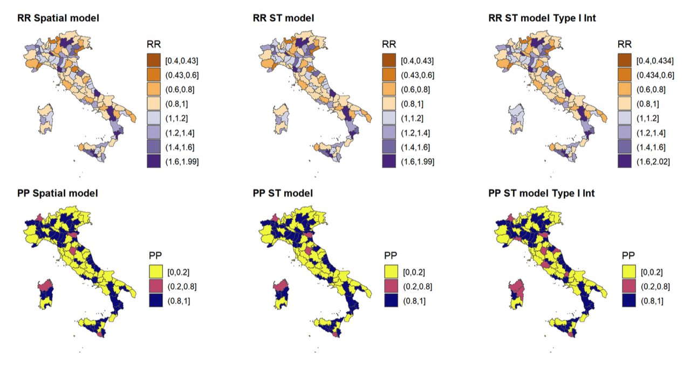
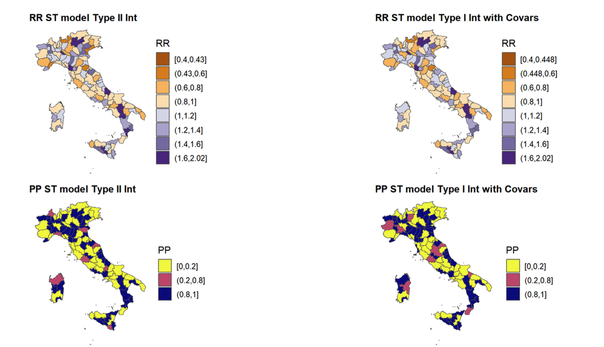

```{r setup, include=FALSE}
knitr::opts_chunk$set(fig.path = "figs/", dpi = 300, out.width = "100%")
```

# Overview

This repository presents a provincial-level spatio-temporal analysis of monthly road-traffic accident injuries across Italy between January 2017 and December 2022. The modelling targets relative risk patterns over space and time and evaluates the role of social vulnerability (Vuln2011) and mean monthly temperature (ERA5) as area-level covariates. The complete write-up is available in `reports/HDA_Group7.pdf`. The main analysis notebook is `HDA_Group7.Rmd`, which renders figures into `figs/` and tables into `output/`.

# What this repository contains

The root folder holds `HDA_Group7.Rmd` for the analysis and `README.Rmd` for this front page; `reports/` stores the final PDF report; `figs/` stores generated graphics; `data/` stores inputs (with `raw/` for original files, `processed/` for derived data, and `shapefiles/` for the provincial boundaries); `scripts/` is reserved for small utilities (for example, data checks or download helpers); `output/` can store exported tables. Git ignores large or private files by default; instructions for obtaining data are below.

# Methods in brief

The analysis uses a hierarchical count model for monthly injuries with population as offset to account for province size. Spatial dependence is handled via a conditional autoregressive prior (BYM2) on province-level effects, temporal dependence via a first-order random walk on months, and optional interaction or seasonal structure where indicated by diagnostics. Social vulnerability and temperature can be introduced as continuous predictors or via categorical transformations; model comparison weighs interpretability, posterior predictive fit, and information criteria.

# Data

The analysis expects a CSV and a province shapefile. Place `Accidents_injuries_final.csv` in `data/raw/`. Place all shapefile components (for example, `.shp`, `.dbf`, `.shx`, `.prj`, `.cpg`) for the Italy provinces in `data/shapefiles/`. If data cannot be published, include a small synthetic sample named `data/raw/sample.csv` with the same schema and provide access instructions here.

| variable      | description                                                                 |
|:--------------|:----------------------------------------------------------------------------|
| reg_code      | region code                                                                 |
| reg_name      | region name                                                                 |
| prov_code     | province code                                                               |
| prov_name     | province name                                                               |
| ID            | province identifier aligned to the shapefile order                          |
| Vuln2011      | social vulnerability index (assumed constant over time)                     |
| Injured       | monthly count of injured individuals in road-traffic accidents              |
| Year          | year (2017–2022)                                                            |
| Month         | month number (1–12)                                                         |
| Month_name    | month name                                                                  |
| pop_tot       | total population in the province                                            |
| mean.temp     | mean monthly temperature (ERA5 reanalysis)                                  |

# Quick start

Install and lock dependencies, then render the notebook and this README. This repository uses `renv` so that others can recreate the same R package environment.

```r
install.packages("renv")
renv::init()

pkgs <- c(
  "tidyverse","sf","spdep","INLA","Matrix","tmap","ggplot2",
  "lubridate","janitor","patchwork","knitr","rmarkdown","readr","here"
)
to_install <- setdiff(pkgs, rownames(installed.packages()))
if (length(to_install)) install.packages(to_install)
renv::snapshot()
```

Render the analysis and front page.

```r
rmarkdown::render("HDA_Group7.Rmd")
rmarkdown::render("README.Rmd")
```

# Reproducibility notes

Set a seed before model fitting where stochastic components are used. Ensure province codes in the CSV match those in the shapefile; if necessary, create a crosswalk and join on a stable key (`prov_code` preferred). Use `pop_tot` as the denominator via a log offset in count models. Treat `Vuln2011` as time-invariant. If temperature is aggregated from ERA5 externally, document the grid, aggregation method, and spatial join.

# Results at a glance

The figures below are inserted automatically when they exist in `figs/`. Knit `HDA_Group7.Rmd` to generate them. Replace the filenames to match your outputs.

```{r echo=FALSE, out.width="100%", fig.cap="Posterior mean relative risk by province, averaged over 2017–2022."}
if (file.exists("figs/risk_map_mean.png")) 
```

```{r echo=FALSE, out.width="100%", fig.cap="Monthly relative risk trajectory for selected provinces with 95% intervals."}
if (file.exists("figs/time_trends_selected.png")) 
```

```{r echo=FALSE, out.width="100%", fig.cap="Association between social vulnerability and injury risk after adjusting for space and time."}
if (file.exists("figs/vulnerability_effect.png")) 
```

```{r echo=FALSE, out.width="100%", fig.cap="Temperature–risk relationship (nonlinear option if modeled with splines)." }
if (file.exists("figs/temperature_effect.png")) 
```

# File paths and expected inputs

The notebook reads `data/raw/Accidents_injuries_final.csv` and the provincial shapefile from `data/shapefiles/`. If paths differ on your system, set a project root with `{here}` or update the `here::here()` calls at the top of `HDA_Group7.Rmd`. Shapefile encodings should be UTF-8; if province names contain diacritics, consider normalising with `stringi` or `janitor`.

# How to cite and license

Cite this repository using the `CITATION.cff` file once created; GitHub will display a “Cite this repository” box automatically. The recommended license for open sharing is MIT; include a `LICENSE` file at the root. If you rely on third-party data, acknowledge the original sources (ISTAT, ERA5) in your report and here.

# Contact

Maintainer: Alex Melendez. For questions or suggestions, open an Issue in this repository.
